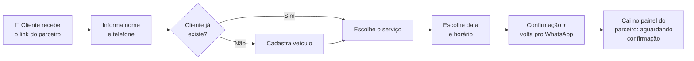

# Autoagendamento

:::note Status
💡 **Ideação** — feature em concepção, ainda sendo idealizada. As telas e endpoints ainda não foram implementados.
:::

## O Que É

O **Autoagendamento** permite que o cliente final agende um serviço **sozinho**, sem precisar conversar com o parceiro para marcar horário. O parceiro envia um link, o cliente abre, informa seus dados, escolhe o serviço, a data e o horário — e o agendamento cai direto no painel do parceiro para confirmação.

A feature vive dentro do projeto **link** (`reforged-partner-link`), onde já existe o fluxo público de captação de leads dos parceiros Detail Lab.

---

## Para Quem É

- **Parceiros Detail Lab** — que querem reduzir o vai-e-volta no WhatsApp para marcar horário. Eles compartilham o link de autoagendamento com seus clientes.
- **Clientes finais** — que querem agendar um serviço de forma rápida, a qualquer hora, sem depender de resposta imediata do parceiro.

---

## Como Funciona (Resumo)

---

## Onde Vive

| Parte | Projeto |
|-------|---------|
| Telas do autoagendamento | **link** (`reforged-partner-link`) |
| Endpoints consumidos | **Detail Lab API** (`reforged-api`) |
| Recebimento do agendamento | **painel web** (`admin_dash_web`) |

---

## Comece Por Aqui

- 📋 **[Visão Geral](./overview.md)** — o fluxo completo, etapa por etapa
- 🎯 **[Casos de Uso](./use-cases.md)** — situações reais de uso
- 🔌 **[Dados e Integrações](./integracoes.md)** — endpoints que a feature usa
- ❓ **[Dúvidas em Aberto](./duvidas.md)** — pontos que precisam de decisão

---

## Status de Desenvolvimento

- [x] Ideia inicial
- [ ] Definição de produto (em andamento)
- [ ] Resolução das dúvidas em aberto
- [ ] Implementação das telas (link)
- [ ] Endpoints públicos na API
- [ ] Novo status de agendamento no painel
- [ ] Lançamento
