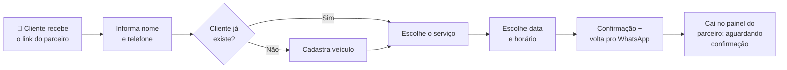

# Autoagendamento

:::note Status
🟡 **Em andamento** — as telas do fluxo já foram implementadas no projeto **link**. Faltam os endpoints públicos na API e o novo status de agendamento no painel.
:::

## O Que É

O **Autoagendamento** permite que o cliente final agende um serviço **sozinho**, sem precisar conversar com o parceiro para marcar horário. O parceiro envia um link, o cliente abre, informa seus dados, escolhe o serviço, a data e o horário — e o agendamento cai direto no painel do parceiro para confirmação.

A feature vive dentro do projeto **link** ([`reforged-partner-link`](https://github.com/mycarpass/reforged-partner-link)), onde já existe o fluxo público de captação de leads dos parceiros Detail Lab.

---

## Para Quem É

- **Parceiros Detail Lab** — que querem reduzir o vai-e-volta no WhatsApp para marcar horário. Eles compartilham o link de autoagendamento com seus clientes.
- **Clientes finais** — que querem agendar um serviço de forma rápida, a qualquer hora, sem depender de resposta imediata do parceiro.

---

## Como Funciona (Resumo)

---

## Onde Vive

| Parte | Projeto | Detalhe |
|-------|---------|---------|
| Telas do autoagendamento | **link** ([`reforged-partner-link`](https://github.com/mycarpass/reforged-partner-link)) | Rota `/{slug}/agendar` · feature `scheduling` |
| Endpoints consumidos | **Detail Lab API** ([`reforged-api`](https://github.com/mycarpass/reforged-api)) | Endpoints públicos (a implementar) |
| Recebimento do agendamento | **painel web** ([`admin_dash_web`](https://github.com/mycarpass/admin_dash_web)) | Status "aguardando confirmação" (a implementar) |

---

## Comece Por Aqui

- 📋 **[Visão Geral](./overview.md)** — o fluxo completo, etapa por etapa
- 🎯 **[Casos de Uso](./use-cases.md)** — situações reais de uso
- 🔌 **[Dados e Integrações](./integracoes.md)** — endpoints que a feature usa
- ❓ **[Dúvidas em Aberto](./duvidas.md)** — pontos que precisam de decisão

---

## Status de Desenvolvimento

- [x] Ideia inicial
- [x] Definição de produto
- [x] Decisões de MVP para as dúvidas em aberto (ver [Dúvidas](./duvidas.md))
- [x] Implementação das telas (link) — feature `scheduling`, rota `/{slug}/agendar`
- [ ] Endpoints públicos na API ([contratos definidos](./integracoes.md))
- [ ] Novo status de agendamento no painel ("aguardando confirmação")
- [ ] Privacidade da consulta pública de cliente (LGPD)
- [ ] Lançamento
