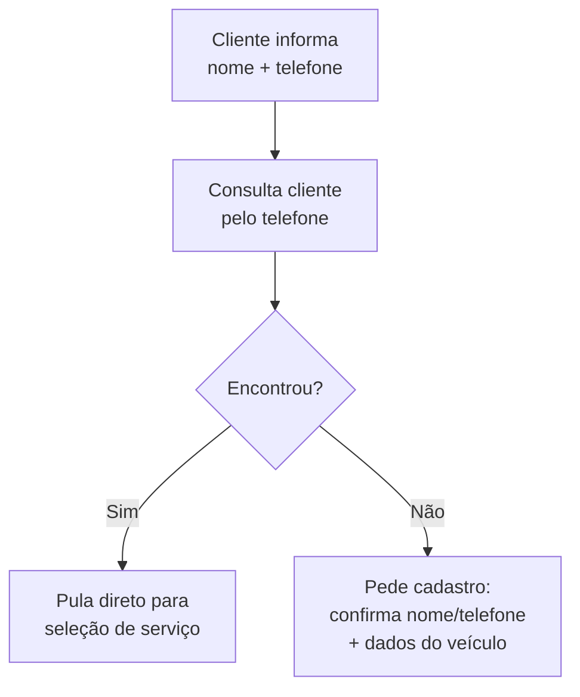
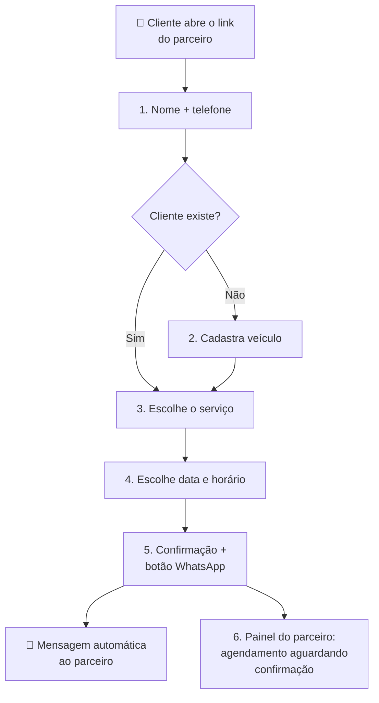

# Visão Geral

O fluxo completo do autoagendamento, da chegada do link até o agendamento aparecer no painel do parceiro.

---

## O Link

O parceiro Detail Lab compartilha com o cliente um link de autoagendamento. O link identifica **qual parceiro** é o dono daquela página — assim como o link público de captação de leads que já existe hoje (`/public/partners/{slug}`), onde `{slug}` é o identificador do parceiro.

Todo o agendamento criado por aquele link é vinculado a esse parceiro.

---

## As Etapas

### 1. Identificação do cliente (nome + telefone)

A primeira tela pede **nome** e **telefone** (WhatsApp). Com o telefone, o sistema consulta a base do parceiro para ver se aquele cliente **já existe**.

### 2a. Cliente já existe → segue para o serviço

Se o cliente é encontrado, ele já tem veículo(s) cadastrado(s) e vai direto para a **seleção de serviço**.

### 2b. Cliente novo → cadastro do veículo

Se não existe, o cliente confirma o nome e o telefone que já digitou e preenche os **dados do veículo**. A estrutura de cadastro espelha o que já existe no painel web e no fluxo de lead atual:

| Campo | Observação |
|-------|------------|
| Fabricante (`manufacturer`) | Ex: Fiat, Chevrolet |
| Modelo (`model`) | Ex: Mobi, Onix |
| Placa (`license_plate`) | Alfanumérica, formatada na exibição |
| Cor (`color`) | |
| Porte (`category`) | **Ponto em aberto** — ver [Dúvidas](./duvidas.md) |

### 3. Seleção do serviço

O cliente vê os serviços oferecidos pelo parceiro e escolhe o que deseja. Os serviços e **preços variam conforme o porte do veículo** — a precificação no Detail Lab é por porte (carroceria).

> ✅ **Decisão de MVP:** o cliente seleciona o porte num seletor com exemplos de modelos; o preço aparece como referência e o **parceiro confirma o valor final**. Ver [Dúvidas em Aberto](./duvidas.md).

### 4. Escolha de data e horário

Com o serviço escolhido, o cliente seleciona o **dia** (próximos 14 dias) e o **horário** desejados. É uma solicitação — o parceiro confirma a disponibilidade.

### 5. Confirmação + volta para o WhatsApp

Uma tela final explica que o **agendamento foi enviado** e mostra um botão para **voltar ao WhatsApp** e falar com o parceiro. Ao clicar, o cliente é levado ao WhatsApp do parceiro com uma mensagem já preenchida, no sentido de:

> "Acabei de fazer meu agendamento pelo link e estou aguardando a confirmação."

> Esse padrão de redirect já existe hoje no fluxo de lead (campo `whatsapp_redirect_url`), então pode ser reaproveitado.

### 6. O agendamento no painel do parceiro

O agendamento aparece no **painel web** do parceiro com o status **aguardando confirmação**.

> ⚠️ Esse status **ainda não existe** no sistema (os status atuais são: na fila, em andamento, finalizado, entregue, cancelado). Será necessário criá-lo. Veja [Dúvidas em Aberto](./duvidas.md).

---

## Jornada Completa

---

## Próximos Passos

👉 [Casos de Uso](./use-cases.md) — cada etapa em detalhe

👉 [Dados e Integrações](./integracoes.md) — endpoints consumidos

👉 [Dúvidas em Aberto](./duvidas.md) — o que precisa ser decidido
