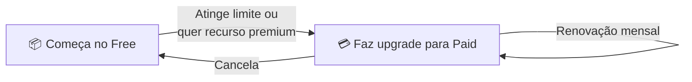

# Visão Geral

Comparação completa entre os planos **Free** e **Paid**, e como o parceiro transita entre eles.

---

## Tipos de Limitação

O plano Free tem **dois tipos de limite**:

### 1️⃣ Bloqueio de Funcionalidade
Recursos avançados ficam **completamente indisponíveis** no Free e só são liberados no Paid.

Exemplos: Meta Financeira, Ticket Médio, Funcionários, Upload de imagens, Reconhecimento de placa, Consulta de veículo.

### 2️⃣ Bloqueio por Quantidade
Recursos essenciais têm um **limite de quantidade**. Alguns renovam todo mês, outros são permanentes até o upgrade.

Exemplos: 30 agendamentos/mês (renova), 30 clientes (permanente), 10 serviços (permanente).

---

## Matriz de Funcionalidades

| Funcionalidade | Tipo | Free | Paid |
|----------------|------|------|------|
| **Agendamento** | Quantidade | 30/mês | ∞ |
| **Clientes** | Quantidade | 30 | ∞ |
| **Serviços** | Quantidade | 10 | ∞ |
| **Meta Financeira** | Bloqueio | ❌ | ✅ |
| **Ticket Médio** | Bloqueio | ❌ | ✅ |
| **Funcionários** | Bloqueio | ❌ | ✅ |
| **Upload de Imagem** | Bloqueio | ❌ | ✅ |
| **Reconhecimento de Placa** | Bloqueio | ❌ | ✅ |
| **Consulta de Veículo** | Bloqueio | ❌ | ✅ |

---

## Jornada do Parceiro

1. O parceiro começa no plano **Free**
2. Usa a plataforma dentro dos limites
3. Ao atingir um limite (ex: 30 agendamentos) ou querer um recurso premium, recebe um convite para upgrade
4. Faz o upgrade para **Paid** e libera tudo
5. Renovação automática a cada ciclo

---

## Próximos Passos

👉 [Casos de Uso](./use-cases.md) — veja a feature em ação

👉 [Plano Free](./free-plan.md) — limites em detalhe

👉 [Plano Paid](./paid-plan.md) — o que o upgrade libera
