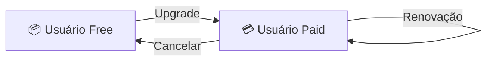
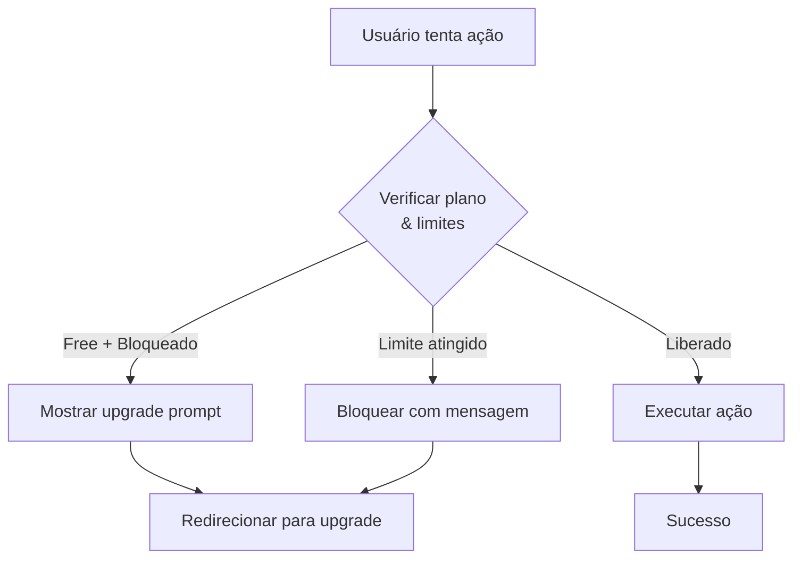
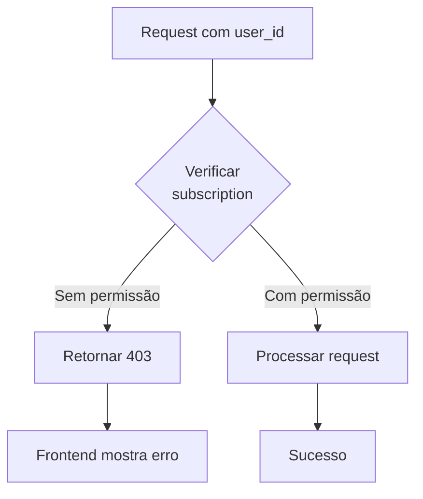

# Overview

## O que são Planos de Assinatura?

Planos de Assinatura definem quais funcionalidades e recursos estão disponíveis para cada usuário baseado no seu plano.

Existem **2 tipos de limitações**:

### 1️⃣ Bloqueio de Funcionalidade
Determinadas features (relatórios, módulos) estão **completamente indisponíveis** no plano Free.

Exemplos:
- ❌ Meta Financeira
- ❌ Ticket Médio
- ❌ Funcionários
- ❌ Upload de imagens

### 2️⃣ Bloqueio por Quantidade
Certos recursos têm **limite de quantidade** que pode ser renovável ou permanente.

Exemplos:
- 30 agendamentos por mês (renovável)
- 30 clientes máximo (permanente)
- 10 serviços máximo (permanente)

---

## Matriz de Funcionalidades

:::info
A tabela abaixo mostra todas as features e sua disponibilidade em cada plano.
:::

| Feature | Tipo | Free | Paid | Renovável |
|---------|------|------|------|-----------|
| **Agendamento** | Quantidade | 30/mês | ∞ | ✅ |
| **Clientes** | Quantidade | 30 | ∞ | ❌ |
| **Serviços** | Quantidade | 10 | ∞ | ❌ |
| **Meta Financeira** | Bloqueio | ❌ | ✅ | - |
| **Ticket Médio** | Bloqueio | ❌ | ✅ | - |
| **Funcionários** | Bloqueio | ❌ | ✅ | - |
| **Upload de Imagem** | Bloqueio | ❌ | ✅ | - |
| **Reconhecimento de Placa** | Bloqueio | ❌ | ✅ | - |
| **Consulta de Veículo** | Bloqueio | ❌ | ✅ | - |

---

## Fluxo de Upgrade



1. Usuário começa no plano **Free**
2. Atinge limite de agendamentos ou quer feature premium
3. Clica em "Upgrade"
4. Faz pagamento
5. Acesso imediato ao plano **Paid**
6. Renovação automática a cada ciclo

---

## Como Funciona a Verificação

### No Frontend



### No Backend



---

## Casos de Uso

### Caso 1: Usuário Free Tenta Criar Agendamento (Limite Atingido)

```
1. Usuário clica "Novo Agendamento"
2. Frontend valida: agendamentos_mes >= 30
3. Botão desabilitado + mensagem: "Limite de 30 atingido"
4. Usuário clica "Upgrade"
5. Redireciona para página de pagamento
```

### Caso 2: Usuário Free Tenta Acessar Meta Financeira

```
1. Usuário clica em "Meta" no menu
2. Menu está oculto/desabilitado
3. Se conseguir navegar diretamente: página mostra upgrade prompt
4. Redireciona para upgrade ou bloqueia acesso
```

### Caso 3: Usuário Paid em Tudo Disponível

```
1. Sem restrições
2. Todas as features visíveis e funcionais
3. Ilimitado em agendamentos, clientes, serviços
```

---

## Configuração Técnica

A verificação de plano é feita em **duas camadas**:

### Camada 1: Frontend
- Feature flags baseado no `plan` do usuário
- Componentes desabilitados/ocultos
- Mensagens de erro amigáveis

### Camada 2: Backend
- Validação de permissão em cada endpoint
- Logs de tentativas bloqueadas
- Retorno de erro apropriado (403 Forbidden)

---

## Próximos Passos

Leia a documentação específica:

👉 [Free Plan Details](./free-plan.md) - Todas as limitações do Free

👉 [Paid Plan Details](./paid-plan.md) - Tudo que está disponível no Paid

👉 [Arquitetura](./decisions/feature-flags.md) - Como implementar

👉 [Schema](./schemas/subscription.md) - Estrutura de dados
