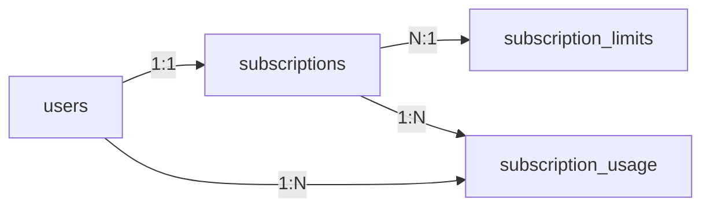

# Subscription Schema

## Tabela: `subscriptions`

```sql
CREATE TABLE subscriptions (
  id BIGINT PRIMARY KEY AUTO_INCREMENT,
  user_id BIGINT NOT NULL UNIQUE,
  plan ENUM('free', 'paid') NOT NULL DEFAULT 'free',
  status ENUM('active', 'cancelled', 'suspended') NOT NULL DEFAULT 'active',
  
  -- Datas
  created_at TIMESTAMP DEFAULT CURRENT_TIMESTAMP,
  updated_at TIMESTAMP DEFAULT CURRENT_TIMESTAMP ON UPDATE CURRENT_TIMESTAMP,
  cancelled_at TIMESTAMP NULL,
  renews_at TIMESTAMP NULL,
  
  -- Configurações do Paid
  billing_cycle ENUM('monthly', 'annual') NULL,
  next_renewal_date DATE NULL,
  stripe_subscription_id VARCHAR(255) NULL,
  
  -- Metadados
  metadata JSON NULL,
  
  FOREIGN KEY (user_id) REFERENCES users(id) ON DELETE CASCADE,
  INDEX idx_user_id (user_id),
  INDEX idx_status (status),
  INDEX idx_plan (plan)
);
```

### Campos

| Campo | Tipo | Descrição |
|-------|------|-----------|
| `id` | BIGINT | PK - ID único da assinatura |
| `user_id` | BIGINT | FK - Usuario owner |
| `plan` | ENUM | 'free' ou 'paid' |
| `status` | ENUM | 'active', 'cancelled', 'suspended' |
| `created_at` | TIMESTAMP | Data de criação |
| `updated_at` | TIMESTAMP | Data de última atualização |
| `cancelled_at` | TIMESTAMP | Data de cancelamento (NULL se ativo) |
| `renews_at` | TIMESTAMP | Data da próxima renovação |
| `billing_cycle` | ENUM | 'monthly' ou 'annual' (NULL para free) |
| `next_renewal_date` | DATE | Data próxima renovação (NULL para free) |
| `stripe_subscription_id` | VARCHAR | ID da assinatura no Stripe |
| `metadata` | JSON | Dados adicionais (JSON) |

---

## Tabela: `subscription_limits`

```sql
CREATE TABLE subscription_limits (
  id BIGINT PRIMARY KEY AUTO_INCREMENT,
  plan ENUM('free', 'paid') NOT NULL,
  feature VARCHAR(255) NOT NULL,
  limit_type ENUM('quantity', 'feature_blocked') NOT NULL,
  limit_value INT NULL,
  renewable BOOLEAN DEFAULT FALSE,
  
  created_at TIMESTAMP DEFAULT CURRENT_TIMESTAMP,
  updated_at TIMESTAMP DEFAULT CURRENT_TIMESTAMP ON UPDATE CURRENT_TIMESTAMP,
  
  UNIQUE KEY unique_plan_feature (plan, feature),
  INDEX idx_plan (plan)
);
```

### Seed Data

```sql
-- Free Plan Limits
INSERT INTO subscription_limits VALUES
-- Quantities (Renewable)
(1, 'free', 'agendamentos_mes', 'quantity', 30, true),

-- Quantities (Non-Renewable)
(2, 'free', 'clientes', 'quantity', 30, false),
(3, 'free', 'servicos', 'quantity', 10, false),

-- Blocked Features
(4, 'free', 'meta', 'feature_blocked', NULL, false),
(5, 'free', 'ticket_medio', 'feature_blocked', NULL, false),
(6, 'free', 'funcionarios', 'feature_blocked', NULL, false),
(7, 'free', 'upload_imagem', 'feature_blocked', NULL, false),
(8, 'free', 'reconhecimento_placa', 'feature_blocked', NULL, false),
(9, 'free', 'consulta_veiculo', 'feature_blocked', NULL, false),

-- Paid Plan (All Unlimited)
(10, 'paid', 'agendamentos_mes', 'quantity', NULL, true),
(11, 'paid', 'clientes', 'quantity', NULL, false),
(12, 'paid', 'servicos', 'quantity', NULL, false);
```

---

## Tabela: `subscription_usage`

```sql
CREATE TABLE subscription_usage (
  id BIGINT PRIMARY KEY AUTO_INCREMENT,
  subscription_id BIGINT NOT NULL,
  user_id BIGINT NOT NULL,
  feature VARCHAR(255) NOT NULL,
  usage_count INT DEFAULT 0,
  reset_date DATE NULL,
  
  created_at TIMESTAMP DEFAULT CURRENT_TIMESTAMP,
  updated_at TIMESTAMP DEFAULT CURRENT_TIMESTAMP ON UPDATE CURRENT_TIMESTAMP,
  
  FOREIGN KEY (subscription_id) REFERENCES subscriptions(id) ON DELETE CASCADE,
  FOREIGN KEY (user_id) REFERENCES users(id) ON DELETE CASCADE,
  UNIQUE KEY unique_sub_feature (subscription_id, feature),
  INDEX idx_subscription_id (subscription_id),
  INDEX idx_user_id (user_id),
  INDEX idx_reset_date (reset_date)
);
```

---

## Relacionamentos



---

## Queries Úteis

### Obter subscription de um usuário

```sql
SELECT * FROM subscriptions WHERE user_id = ? AND status = 'active';
```

### Obter limites de um plano

```sql
SELECT * FROM subscription_limits WHERE plan = 'free';
```

### Obter uso atual de uma feature

```sql
SELECT usage_count FROM subscription_usage 
WHERE user_id = ? AND feature = 'agendamentos_mes';
```

### Verificar se usuário atingiu limite

```sql
SELECT 
  sl.limit_value,
  su.usage_count,
  (su.usage_count >= sl.limit_value) AS limit_reached
FROM subscription_limits sl
LEFT JOIN subscription_usage su ON sl.feature = su.feature
WHERE sl.plan = (SELECT plan FROM subscriptions WHERE user_id = ?)
  AND sl.feature = 'agendamentos_mes';
```

---

## Migrações

### Migration 1: Create subscriptions table

```sql
-- up
CREATE TABLE subscriptions (
  id BIGINT PRIMARY KEY AUTO_INCREMENT,
  user_id BIGINT NOT NULL UNIQUE,
  plan ENUM('free', 'paid') NOT NULL DEFAULT 'free',
  status ENUM('active', 'cancelled', 'suspended') NOT NULL DEFAULT 'active',
  created_at TIMESTAMP DEFAULT CURRENT_TIMESTAMP,
  updated_at TIMESTAMP DEFAULT CURRENT_TIMESTAMP ON UPDATE CURRENT_TIMESTAMP,
  cancelled_at TIMESTAMP NULL,
  renews_at TIMESTAMP NULL,
  billing_cycle ENUM('monthly', 'annual') NULL,
  next_renewal_date DATE NULL,
  stripe_subscription_id VARCHAR(255) NULL,
  metadata JSON NULL,
  FOREIGN KEY (user_id) REFERENCES users(id) ON DELETE CASCADE,
  INDEX idx_user_id (user_id),
  INDEX idx_status (status),
  INDEX idx_plan (plan)
);

-- down
DROP TABLE subscriptions;
```

### Migration 2: Create subscription_limits table

```sql
-- up
CREATE TABLE subscription_limits (
  id BIGINT PRIMARY KEY AUTO_INCREMENT,
  plan ENUM('free', 'paid') NOT NULL,
  feature VARCHAR(255) NOT NULL,
  limit_type ENUM('quantity', 'feature_blocked') NOT NULL,
  limit_value INT NULL,
  renewable BOOLEAN DEFAULT FALSE,
  created_at TIMESTAMP DEFAULT CURRENT_TIMESTAMP,
  updated_at TIMESTAMP DEFAULT CURRENT_TIMESTAMP ON UPDATE CURRENT_TIMESTAMP,
  UNIQUE KEY unique_plan_feature (plan, feature),
  INDEX idx_plan (plan)
);

-- down
DROP TABLE subscription_limits;
```

### Migration 3: Create subscription_usage table

```sql
-- up
CREATE TABLE subscription_usage (
  id BIGINT PRIMARY KEY AUTO_INCREMENT,
  subscription_id BIGINT NOT NULL,
  user_id BIGINT NOT NULL,
  feature VARCHAR(255) NOT NULL,
  usage_count INT DEFAULT 0,
  reset_date DATE NULL,
  created_at TIMESTAMP DEFAULT CURRENT_TIMESTAMP,
  updated_at TIMESTAMP DEFAULT CURRENT_TIMESTAMP ON UPDATE CURRENT_TIMESTAMP,
  FOREIGN KEY (subscription_id) REFERENCES subscriptions(id) ON DELETE CASCADE,
  FOREIGN KEY (user_id) REFERENCES users(id) ON DELETE CASCADE,
  UNIQUE KEY unique_sub_feature (subscription_id, feature),
  INDEX idx_subscription_id (subscription_id),
  INDEX idx_user_id (user_id),
  INDEX idx_reset_date (reset_date)
);

-- down
DROP TABLE subscription_usage;
```
