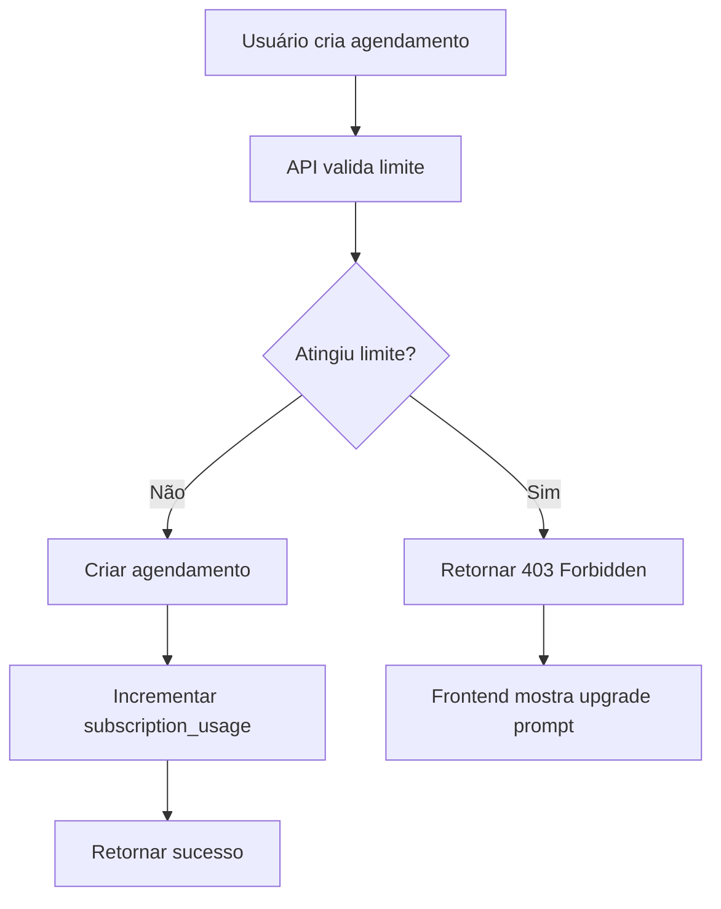

# Usage Tracking Schema

## Visão Geral

O sistema de rastreamento de uso (`subscription_usage`) monitora quantas vezes um usuário utilizou features com limites renováveis ou não-renováveis.

---

## Tabela: `subscription_usage`

```sql
CREATE TABLE subscription_usage (
  id BIGINT PRIMARY KEY AUTO_INCREMENT,
  subscription_id BIGINT NOT NULL,
  user_id BIGINT NOT NULL,
  feature VARCHAR(255) NOT NULL,
  usage_count INT DEFAULT 0,
  reset_date DATE NULL,
  
  created_at TIMESTAMP DEFAULT CURRENT_TIMESTAMP,
  updated_at TIMESTAMP DEFAULT CURRENT_TIMESTAMP ON UPDATE CURRENT_TIMESTAMP,
  
  FOREIGN KEY (subscription_id) REFERENCES subscriptions(id) ON DELETE CASCADE,
  FOREIGN KEY (user_id) REFERENCES users(id) ON DELETE CASCADE,
  UNIQUE KEY unique_sub_feature (subscription_id, feature),
  INDEX idx_subscription_id (subscription_id),
  INDEX idx_user_id (user_id),
  INDEX idx_reset_date (reset_date)
);
```

### Campos

| Campo | Tipo | Descrição |
|-------|------|-----------|
| `id` | BIGINT | PK - ID único do registro |
| `subscription_id` | BIGINT | FK - Assinatura do usuário |
| `user_id` | BIGINT | FK - Usuário (denormalizado para query rápida) |
| `feature` | VARCHAR | Nome da feature (ex: 'agendamentos_mes', 'clientes') |
| `usage_count` | INT | Quantidade atual usada |
| `reset_date` | DATE | Data do próximo reset (NULL para não-renováveis) |
| `created_at` | TIMESTAMP | Data de criação do registro |
| `updated_at` | TIMESTAMP | Data de atualização |

---

## Features Rastreadas

### 1. Agendamentos por Mês (Renovável)

```
Feature: agendamentos_mes
Limite: 30
Tipo: Renovável
Reset: 1º de cada mês automaticamente
```

**Lógica:**
- Incrementa em +1 cada vez que um agendamento é criado
- Reset automático todo dia 1º do mês
- Mensagem: "25/30 agendamentos utilizados"

**Queries:**
```sql
-- Obter uso atual
SELECT usage_count FROM subscription_usage 
WHERE user_id = ? AND feature = 'agendamentos_mes';

-- Incrementar uso
UPDATE subscription_usage 
SET usage_count = usage_count + 1 
WHERE user_id = ? AND feature = 'agendamentos_mes';

-- Reset mensal (CRON)
UPDATE subscription_usage 
SET usage_count = 0, reset_date = DATE_ADD(NOW(), INTERVAL 1 MONTH)
WHERE feature = 'agendamentos_mes' AND MONTH(reset_date) = MONTH(NOW());
```

### 2. Clientes (Não-Renovável)

```
Feature: clientes
Limite: 30
Tipo: Não-Renovável
Reset: ❌ Nunca (até upgrade)
```

**Lógica:**
- Incrementa em +1 cada vez que um cliente é criado
- Nunca reseta (permanente)
- Mensagem: "28/30 clientes adicionados"

**Query:**
```sql
-- Obter contagem total
SELECT usage_count FROM subscription_usage 
WHERE user_id = ? AND feature = 'clientes';
```

### 3. Serviços (Não-Renovável)

```
Feature: servicos
Limite: 10
Tipo: Não-Renovável
Reset: ❌ Nunca (até upgrade)
```

**Lógica:**
- Incrementa em +1 cada vez que um serviço é criado
- Nunca reseta (permanente)
- Mensagem: "9/10 serviços adicionados"

---

## Seed Data

```sql
-- Criar registros de uso para novo usuário (Free)
INSERT INTO subscription_usage (subscription_id, user_id, feature, usage_count, reset_date) VALUES
(?, ?, 'agendamentos_mes', 0, DATE_ADD(LAST_DAY(NOW()), INTERVAL 1 DAY)),
(?, ?, 'clientes', 0, NULL),
(?, ?, 'servicos', 0, NULL);
```

---

## Operações Comuns

### Incrementar Uso

```php
// Laravel exemplo
$usage = SubscriptionUsage::where('user_id', $userId)
  ->where('feature', 'agendamentos_mes')
  ->increment('usage_count');
```

### Verificar Limite

```php
$limit = SubscriptionLimit::where('plan', $plan)
  ->where('feature', 'agendamentos_mes')
  ->value('limit_value');

$usage = SubscriptionUsage::where('user_id', $userId)
  ->where('feature', 'agendamentos_mes')
  ->value('usage_count');

if ($usage >= $limit) {
  return response('Limite atingido', 403);
}
```

### Reset Automático (CRON)

```php
// Cron Job: rodas todo dia 1º do mês
Artisan::command('subscription:reset-monthly-usage', function () {
  SubscriptionUsage::where('feature', 'agendamentos_mes')
    ->update([
      'usage_count' => 0,
      'reset_date' => now()->addMonth()
    ]);
});
```

---

## Fluxo de Atualização de Uso



---

## Relatórios Úteis

### Uso por Usuário

```sql
SELECT 
  u.id,
  u.email,
  s.plan,
  su.feature,
  su.usage_count,
  sl.limit_value,
  ROUND((su.usage_count / sl.limit_value) * 100, 0) as percentage
FROM users u
JOIN subscriptions s ON u.id = s.user_id
JOIN subscription_usage su ON s.id = su.subscription_id
JOIN subscription_limits sl ON s.plan = sl.plan AND su.feature = sl.feature
WHERE s.plan = 'free'
ORDER BY percentage DESC;
```

### Usuários Próximos ao Limite

```sql
SELECT 
  u.email,
  su.feature,
  su.usage_count,
  sl.limit_value,
  (sl.limit_value - su.usage_count) as remaining
FROM users u
JOIN subscriptions s ON u.id = s.user_id
JOIN subscription_usage su ON s.id = su.subscription_id
JOIN subscription_limits sl ON s.plan = sl.plan AND su.feature = sl.feature
WHERE s.plan = 'free' 
  AND su.usage_count >= (sl.limit_value * 0.8);
```

### Reset Automático - Status

```sql
SELECT 
  feature,
  COUNT(*) as total_records,
  SUM(CASE WHEN reset_date > NOW() THEN 1 ELSE 0 END) as pending_reset,
  SUM(CASE WHEN reset_date <= NOW() THEN 1 ELSE 0 END) as overdue_reset
FROM subscription_usage
GROUP BY feature;
```

---

## Limpeza de Dados

### Cuando usuário faz upgrade para Paid

```php
// Manter histórico, apenas marcar como irrelevante
SubscriptionUsage::where('subscription_id', $subscriptionId)
  ->update(['archived_at' => now()]);
```

### Quando assinatura é cancelada

```php
// Manter dados (audit trail) mas marcar como inativo
SubscriptionUsage::where('subscription_id', $subscriptionId)
  ->update(['active' => false]);
```

---

## Monitoramento

### Alertas Recomendados

```
1. Usuário atingiu 80% do limite mensal
   → Enviar email de aviso
   
2. Usuário atingiu limite permanente (clientes/serviços)
   → Bloquear operação
   → Mostrar upgrade prompt
   
3. Reset automático falhou
   → Alertar DevOps
   → Verificar CRON
```

---

## Próximos Passos

👉 [Subscription Schema](./subscription) - Estrutura principal

👉 [Feature Flags](../decisions/feature-flags) - Como verificar limites no código
